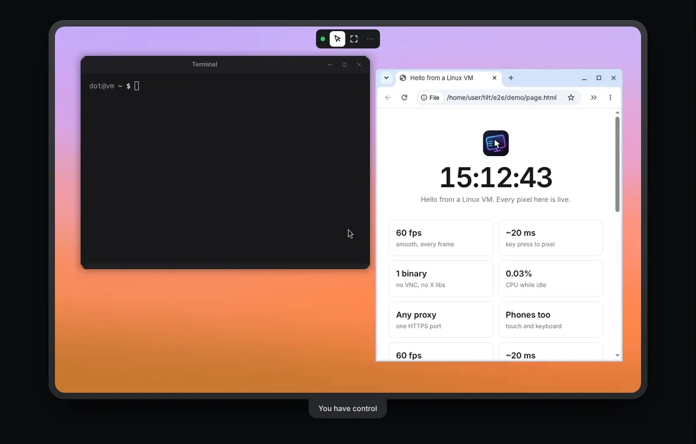

<p align="center">
  
</p>
<h1 align="center">tilt</h1>
<p align="center">
  <b>See and control any Linux desktop, right in your browser.</b><br>
  Fast. Tiny. One command.
</p>
<p align="center">
  <a href="https://github.com/cloudycotton/tilt/releases/latest"></a>
  <a href="https://www.npmjs.com/package/tilt-live"></a>
  <a href="https://github.com/cloudycotton/tilt/actions/workflows/ci.yml"></a>
</p>
<p align="center">
  <br>
  <sub><a href="docs/demo.mp4">Watch it at 60 fps</a></sub>
</p>

## Try it

```sh
npx tilt-live
```

Open the link it prints, click the cursor button, and the desktop is yours.

<sub>No Node? `curl -fsSL https://raw.githubusercontent.com/cloudycotton/tilt/main/install.sh | sh` then `tilt-live`.</sub>

## Why tilt

- ⚡ **Fast.** 60 fps, about 20 ms from key press to pixel.
- 🪶 **Tiny.** One static binary. Almost no CPU while nobody watches.
- 🌐 **Goes anywhere.** One HTTPS port. Happy behind proxies and gateways.
- 📱 **Any device.** Mouse, keyboard, touch, paste, view-only links.

## Next

- **Docker, servers, E2B, Sail, flags:** [the guide](docs/guide.md)
- **Writing your own client:** [the protocol](docs/protocol.md)

<details>
<summary><b>Develop</b></summary>

```sh
cargo test                                      # add -- --include-ignored with Xvfb
(cd e2e/mock && npm ci && npx playwright test)  # web client
scripts/demo.sh                                 # re-records docs/demo.webp
```

A release ships on every push to `main` that bumps the version in `Cargo.toml`.
</details>

MIT licensed.
