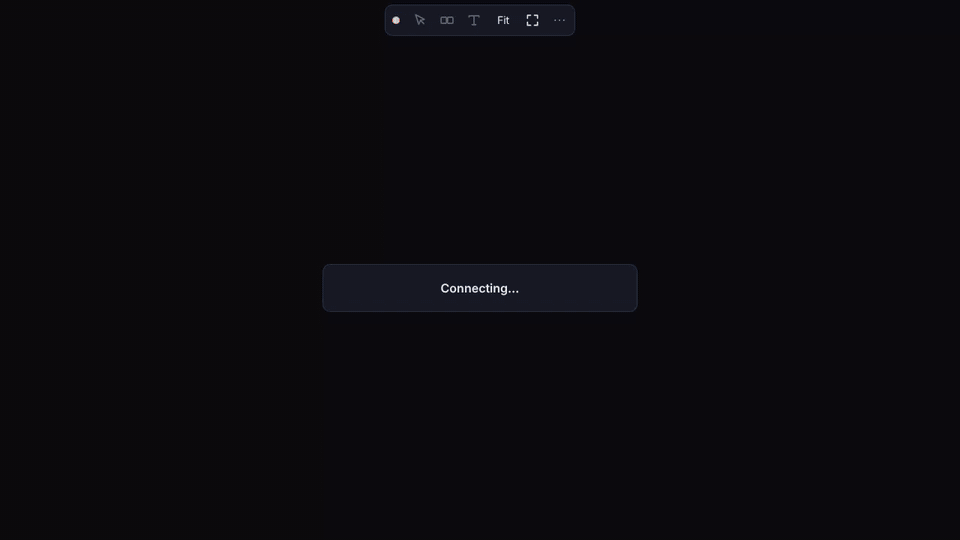

<p align="center">
  
</p>
<h1 align="center">tilt</h1>
<p align="center">
  <b>Extremely fast live view and control of any Linux desktop, right in your browser.</b><br>
  60 fps · ~20 ms from key press to pixel · one static Rust binary
</p>
<p align="center">
  <a href="https://github.com/cloudycotton/tilt/releases/latest"></a>
  <a href="https://www.npmjs.com/package/tilt-live"></a>
  <a href="https://github.com/cloudycotton/tilt/actions/workflows/ci.yml"></a>
</p>
<p align="center">
  
</p>

## Run it

```sh
npx tilt-live
```

or, without Node: `curl -fsSL https://raw.githubusercontent.com/cloudycotton/tilt/main/install.sh | sh`, then `tilt-live`.

It prints a link with a fresh access token: open it, press the cursor button, and the desktop is
yours. Both always run the latest release, updating themselves on start. Flags pass through to
tilt (`tilt-live --display :1`); the [guide](docs/guide.md) lists them all.

## Why tilt

- **Fast**: damage-driven capture, H.264 decoded by WebCodecs, every frame drawn the moment it arrives.
- **Light**: ~0.03% of a core and 14 MB while nobody watches; typing costs ~3% of a core.
- **Anywhere**: one HTTP/1.1 port, happy behind HTTPS gateways and path prefixes (`https://gw/vm1/`).
- **Complete**: mouse, keyboard, touch, paste-as-typing, view-only links and several viewers.

## Docs

[Guide](docs/guide.md) · [Remote VM behind a gateway](docs/guide.md#a-remote-linux-vm-behind-a-proxied-url) · [Wire protocol](docs/protocol.md)

## Develop

```sh
cargo test                                   # unit tests; -- --include-ignored with Xvfb
(cd e2e/mock && npm ci && npx playwright test)
scripts/demo.sh                              # re-records docs/demo.gif
```

A release is cut on every push to `main` that raises the version in `Cargo.toml`. MIT licensed.
